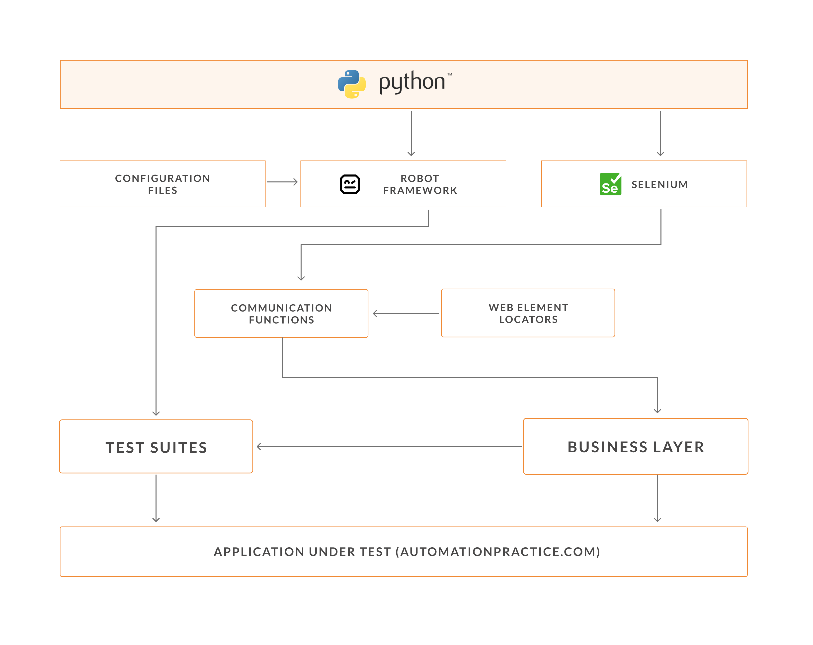

# uiautomate

Project uiautomate is Test Automation Framework for automationpractice.com.

## Prerequisites

* python >= 3.6


## Installation

* python3 installation :
```bash
# Use below wget command for offline python installation
wget https://www.python.org/ftp/python/3.6.3/Python-3.6.3.tgz
tar xvf Python-3.6.3.tgz
cd Python-3.6.3
./configure --enable-optimizations
make
```
* python modules installation :
```bash
cd uiautomate
pip3 install -r requirements.txt
```
We are ready to run automated test cases now.

## Usage

How to run test cases :

```bash
cd uiautomate
python3 runner.py suites/registration.py config=practice.cfg
```
The python file (suites/registration.py) contains 5 test cases.

Test cases can be executed using a single python file (suites/registration.py) or we can execute a full test suite having multiple python files. For e.g.: suites/Registration/ (where suites/Registration/ is a directory containing multiple python files, each file having multiple test cases)

We can also execute a single test case from any python file :

```bash 
python3 runner.py suites/registration.py config=practice.cfg tc=TC001
```

Tests can also be executed in headless mode (on a linux machine where we don't have display, and browser window can not be launched). There is 1 config to enable/disable headless mode, available in conf/practice.cfg :

```bash
headless_mode = Yes
```

### Reporting

Test reports are generated automatically at the end of test execution. User gets the link to HTML test report of each execution in the terminal itself.

Example Test Report :


## Framework Design


